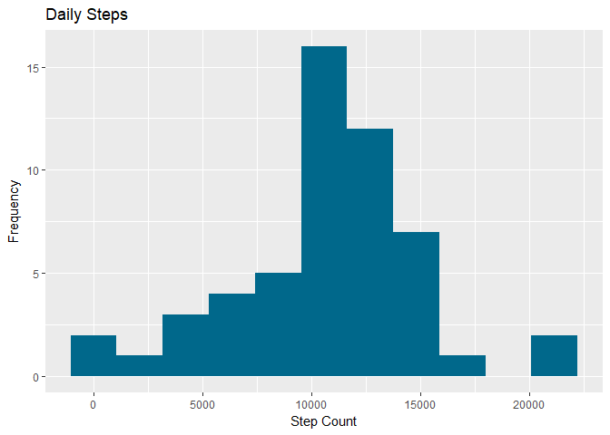
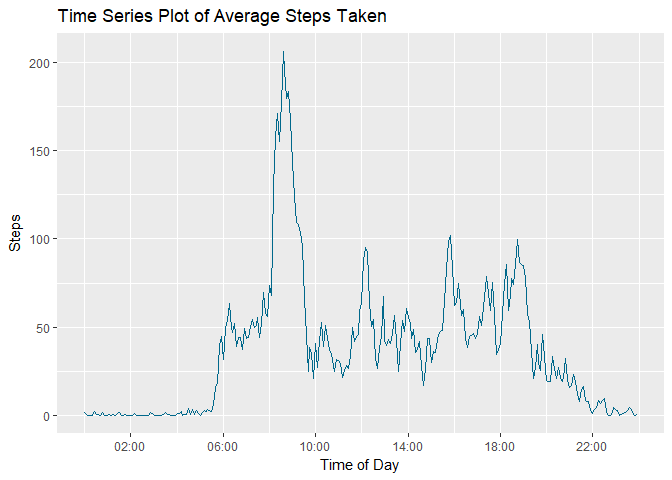
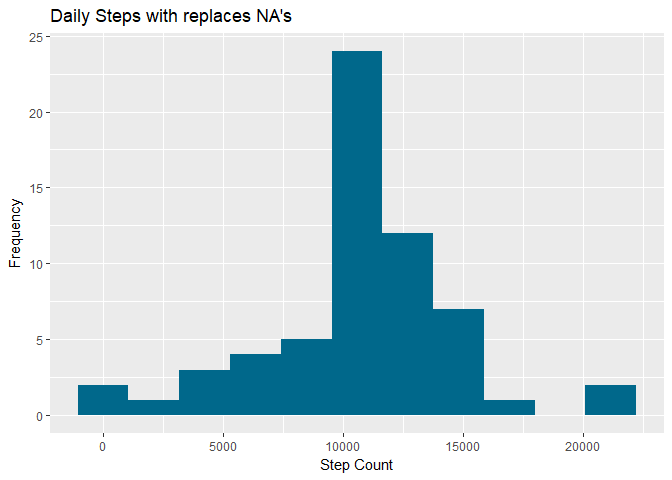
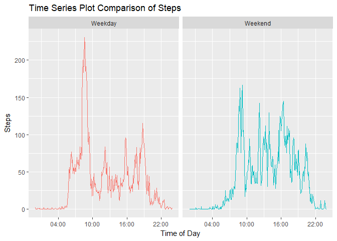

## Introduction
It is now possible to collect a large amount of data about personal movement using activity monitoring devices such as a [Fitbit](https://www.fitbit.com/home), [Nike Fuelband](https://www.nike.com/us/en_us/c/nikeplus-fuelband), or [Jawbone Up](https://jawbone.com/up). These type of devices are part of the “quantified self” movement – a group of enthusiasts who take measurements about themselves regularly to improve their health, to find patterns in their behavior, or because they are tech geeks. But these data remain under-utilized both because the raw data are hard to obtain and there is a lack of statistical methods and software for processing and interpreting the data.

This assignment makes use of data from a personal activity monitoring device. This device collects data at 5 minute intervals through out the day. The data consists of two months of data from an anonymous individual collected during the months of October and November, 2012 and include the number of steps taken in 5 minute intervals each day.

The data for this assignment can be downloaded from the course web site:

* Dataset: [Activity monitoring data](https://d396qusza40orc.cloudfront.net/repdata%2Fdata%2Factivity.zip) [52K]

The variables included in this dataset are:

- **steps**: Number of steps taking in a 5-minute interval (missing values are coded as *NA*) </br>
- **date**: The date on which the measurement was taken in YYYY-MM-DD format </br>
- **interval**: Identifier for the 5-minute interval in which measurement was taken </br>
The dataset is stored in a comma-separated-value (CSV) file and there are a total of 17,568 observations in this dataset.


## Loading the required packages

```r
library(data.table)
library(ggplot2)
library(scales)
library(lubridate)
```

## Loading in Data
Downloading and unzipping data to obtain the csv file.

```r
url <- "https://d396qusza40orc.cloudfront.net/repdata%2Fdata%2Factivity.zip"
download.file(url, destfile = "Factivity.zip")
unzip("Factivity.zip")
```

Reading csv into a data.table.

```r
activity_data <-fread("activity.csv")
```

## Creating a Histogram of the total number of steps taken each day

```r
activity_data$date <- as.Date(activity_data$date)
total_steps <- aggregate(steps ~ date, data = activity_data, sum)
plot1 <- ggplot(total_steps, aes(x=steps)) +
  geom_histogram(fill = "deepskyblue4", bins = 11) +
  labs(title = "Daily Steps", x = "Step Count", y = "Frequency")
print(plot1)
```

<!-- -->

## The mean and median of steps taken per day

```r
mean(total_steps$steps, na.rm = T)
```

```
## [1] 10766.19
```

```r
median(total_steps$steps, na.rm = T)
```

```
## [1] 10765
```

## Time Series plot of the average number of steps taken in a day.
Calculating the average steps taken for each 5-minute interval.

```r
interval_steps <- aggregate(steps ~ interval, data = activity_data, mean)
```

Converting 'interval' column data to a vailid date-time format.

```r
interval_steps$time <- as.character(interval_steps$interval)
for (i in 1:2){
  interval_steps$time[i] <- as.character(paste0("0",interval_steps$time[i]))
}
for (i in 1:12){
  interval_steps$time[i] <- as.character(paste0("00",interval_steps$time[i]))
}
for (i in 13:120){
  interval_steps$time[i] <- as.character(paste0("0",interval_steps$time[i]))
}
interval_steps$time <- as.POSIXct(interval_steps$time, format = "%H%M")
```

Now that we have the valid date-time format we can have a cleaner looking time-series plot, for the average 24-hour period.

```r
plot2 <- ggplot(interval_steps, aes(x = time, y = steps)) +
  geom_line(col = "deepskyblue4") +
  labs(title = "Time Series Plot of Average Steps Taken", x = "Time of Day", y = "Steps") +
  scale_x_datetime(labels = date_format("%H:%M", tz = "MST"), date_breaks = "4 hours")
print(plot2)
```

<!-- -->

## The 5-minute interval that on average contains the maximum number of steps

```r
interval_steps[which.max(interval_steps$steps),1:2]
```

```
##     interval    steps
## 104      835 206.1698
```

## Imputing missing data
The total amount of NA's and the percentage of missing step data.

```r
nas <- is.na(activity_data$steps)
sum(nas)
```

```
## [1] 2304
```

```r
mean(nas)
```

```
## [1] 0.1311475
```
Function to impute the mean for a 5-minute interval into the appropriate mssing data (NA's).

```r
replaceNas= function(steps, interval) {
  replace = NA
  if (!is.na(steps)) { 
    replace = steps } 
  else { 
    replace = interval_steps[interval_steps$interval == interval, "steps"]}
  return(replace) }
```
Apply 'replaceNas' function.

```r
filled_activity_data = activity_data
filled_activity_data$steps = mapply(replaceNas, filled_activity_data$steps, filled_activity_data$interval)
```

## Histogram of the total number of steps taken each day after missing values were imputed

```r
total_steps_filled <- aggregate(steps ~ date, data = filled_activity_data, sum)
plot3 <- ggplot(total_steps_filled, aes(x = steps)) + 
  geom_histogram(fill = "deepskyblue4", bins = 11) + 
  labs(title = "Daily Steps with replaces NA's", x = "Step Count", y = "Frequency")
print(plot3)
```

<!-- -->

## Panel plot comparing the average number of steps taken per 5-minute intervals for Weekdays and Weekends
Creating two new factor variables showing the day of the week, and if its a weekday of weekend. 

```r
filled_activity_data$day <- weekdays(filled_activity_data$date)
weekday <- c("Monday","Tuesday","Wednesday","Thursday","Friday")
weekDayOp <- function(dayofweek) {
  fill = ""
  if (dayofweek %in% weekday) {
    fill = "Weekday" }
  else {
    fill = "Weekend" }
  return(fill) }

filled_activity_data$weekday <- mapply(weekDayOp,filled_activity_data$day)
```

Calculating the average number of steps per 5-minute interval for weekdays and weekends.

```r
filled_totals_day <- aggregate(steps ~ interval + weekday, data = filled_activity_data, mean)
```

Coverting 'interval' column data to a vailid date-time format.

```r
filled_totals_day$time <- as.character(filled_totals_day$interval)
for (i in 1:2){
  filled_totals_day$time[i] <- as.character(paste0("0",filled_totals_day$time[i]))
}
for (i in 1:12){
  filled_totals_day$time[i] <- as.character(paste0("00",filled_totals_day$time[i]))
}
for (i in 13:120){
  filled_totals_day$time[i] <- as.character(paste0("0",filled_totals_day$time[i]))
}
for (i in 289:290){
  filled_totals_day$time[i] <- as.character(paste0("0",filled_totals_day$time[i]))
}
for (i in 289:300){
  filled_totals_day$time[i] <- as.character(paste0("0",filled_totals_day$time[i]))
}
for (i in 301:408){
  filled_totals_day$time[i] <- as.character(paste0("0",filled_totals_day$time[i]))
}
filled_totals_day$time <- as.POSIXct(filled_totals_day$time, format = "%H%M")
```

Now that we have the valid date time format we can have a cleaner looking Time-Seriesplot, for comparison of the average 24-hour period on weekdays and weekends.

```r
plot4 <- ggplot(filled_totals_day, aes(time, steps, col = factor(weekday))) +
  facet_grid(.~factor(weekday)) +
  geom_line(show.legend = F) +
  labs(x = "Time of Day") +
  labs(y = "Steps") +
  labs(title = "Time Series Plot Comparison of Steps") +
  scale_x_datetime(labels = date_format("%H:%M", tz = "MST"), date_breaks = "6 hours")
print(plot4)
```

<!-- -->
